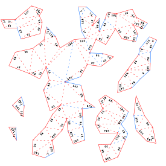

# paperfoldmodels
A python module that unfolds triangulated surfaces to a two-dimensional net. The result can be used to create papercraft models. 

The python bindings of [OpenMesh](http://www.openmesh.org) are used and thus the original mesh can be loaded from any format supported by it.
The output consists of several SVG files, each containing an intersection-free component of the unfolding.

## Dependencies
* Python 3
* NumPy
* OpenMesh
* NetworkX

## Example
The usage is shown in testUnfold.py

Unfolding of the stanford bunny:

The colors indicate the folding direction and the numbers the corresponding glued edge.

## Method
The algorithm consists of three steps:

1. Find a minimum spanning tree of the dual graph of the mesh.
2. Unfold the dual graph.
3. Remove self-intersections by adding additional cuts along edges. 

## Reference
The code is mostly based on the algorithm presented in this [report](https://geom.ivd.kit.edu/downloads/proj-paper-models_cut_out_sheets.pdf) by Straub and Prautzsch.

## Language
Because the orignal target audience was a group of German-speaking high-school students, many of the comments are written in German.

## Author
**Felix Scholz** <felix.scholz@ricam.oeaw.ac.at>
